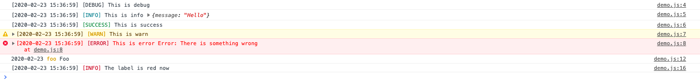

# log-talk

Simple logger designed for browser and terminal.

- Line number where a bug occured (only for browser console now)
- Timestamp when a bug occured
- Highlight
- Observe log message
- Customizable

## Usage

Use npm to install.

```
npm install --save log-talk
```

```JavaScript
const LogTalk = require('log-talk');
const logger = new LogTalk();

// Default methods
logger.debug('This is debug');
logger.info('This is info', { message: 'Hello' });
logger.success('This is success');
logger.warn('This is warn');
logger.error('This is error', new Error('There is something wrong'));

// Define your own method
logger.setMethod({ name: 'foo', color: 'yellow', timeFormat: '[[]YYYY-MM-DD HH:mm:ss]' });
logger.foo('Foo');

// Override default methods
logger.setMethod({ name: 'info', color: 'red' });
logger.info('Now the label is red');
```

You can see this demo [here](https://rikuson.github.io/log-talk/) on your browser.

### Screenshot



## Log level

You can hide low level log such as debug.

```JavaScript
const LogTalk = require('log-talk');
const minLevel = 3;
const logger = new LogTalk(minLevel);
```

## Label

Set `label` option to customize label.  
If you don't set label, `name` option is used as label.

```JavaScript
const LogTalk = require('log-talk');
const logger = new LogTalk();
logger.setMethod({ name: 'foo', label: 'Foo' });
```

## Time format

Set `timeFormat` option to customize time format.

```JavaScript
const LogTalk = require('log-talk');
const logger = new LogTalk();
logger.setMethod({ name: 'foo', timeFormat: 'YYYY-MM-DD' });
```

It depends on Day.js to generate time string.  
Formatting rules are [here](https://day.js.org/docs/en/display/format).

## Highlight

Set `color` option to highlight.  
**NOTE: IE ignores color.**

```JavaScript
const LogTalk = require('log-talk');
const logger = new LogTalk();
logger.setMethod({ name: 'foo', color: 'yellow' });
```

These are defined colors.
- default
- blue
- green
- yellow
- red

It's not flexible and few though.  
I will improve it soon.

## Default Methods

| name    | level | color   |
|:--------|------:|:--------|
| debug   |     1 | default | 
| info    |     2 | blue    | 
| success |     3 | green   | 
| warn    |     4 | yellow  | 
| error   |     5 | red     | 

## Browser Support

- IE@11
- Edge
- Firefox
- Chrome
- Safari

